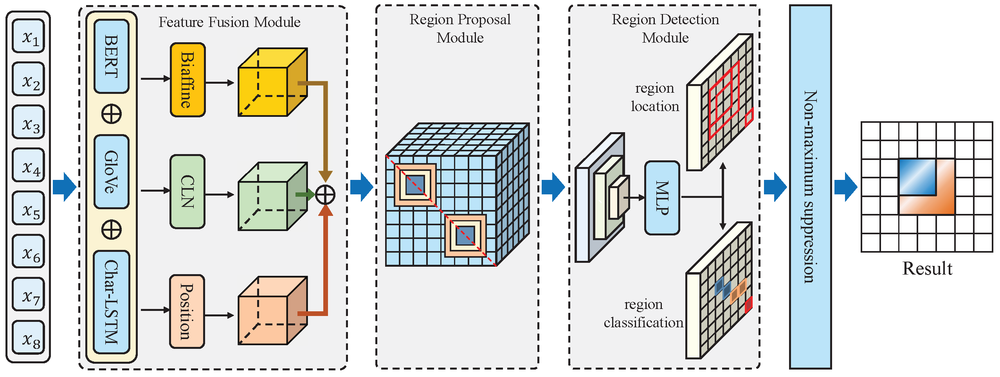

# RR2NER: A Region Representation for Entity Tagging and Locating

RR2NER is a deep learning framework designed to solve the **ambiguity problem** in 2D semantic plane NER methods. Traditional element-classification approaches often struggle with "false positive" errors because adjacent elements (overlapping spans) share highly similar contextual features. SS2NER addresses this by shifting from **element representation** to **region representation**, treating named entities as distinct spatial regions within the semantic plane.

---

## 🚀 Key Features
<p align="center">
  
</p>

## 🏗️ Architecture Overview


---

## 🏃 Running the Project

### Prerequisites
* Python 3.x
* PyTorch
* Transformers
* Prettytable

### Training and Testing

```python
dataset_list = ["ace05", "ace04", "genia"]
# The script will iterate through these, training and evaluating each.
